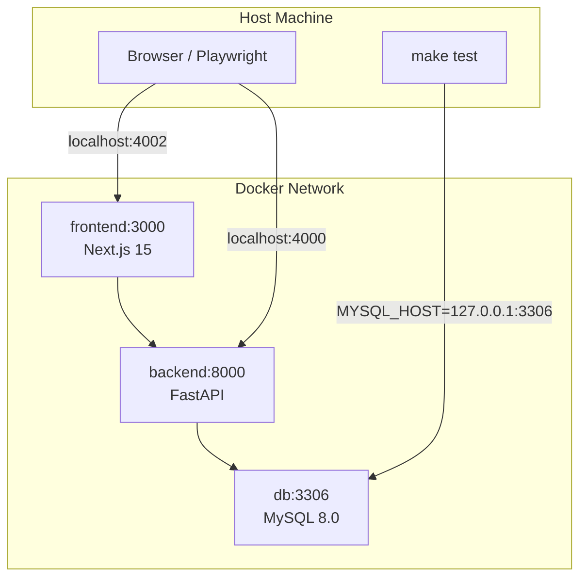
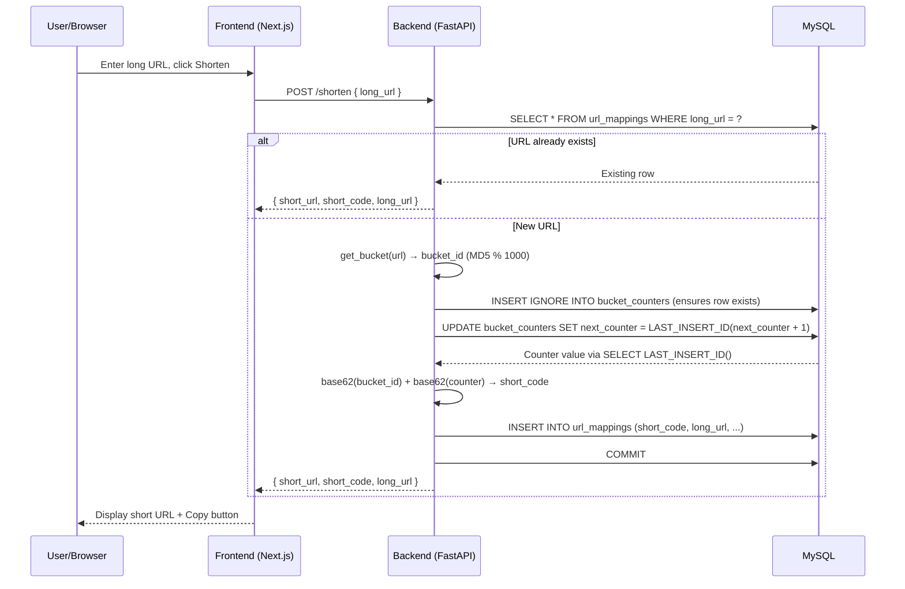
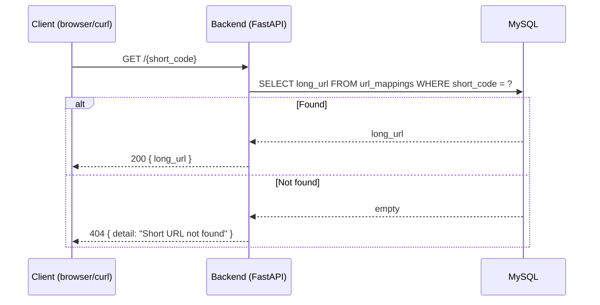
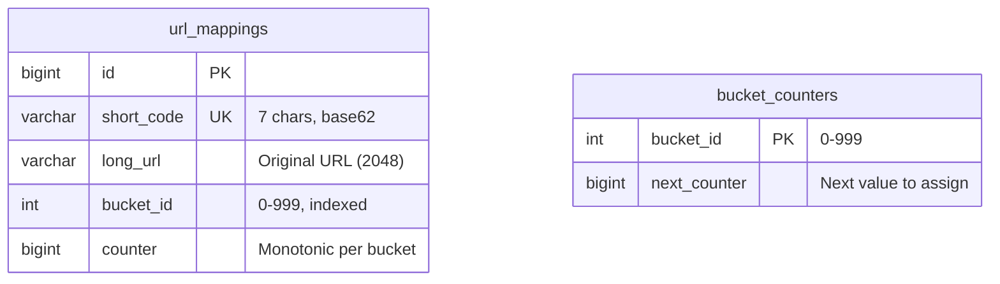
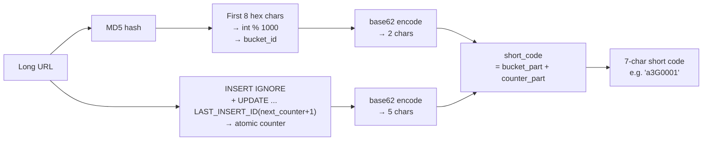
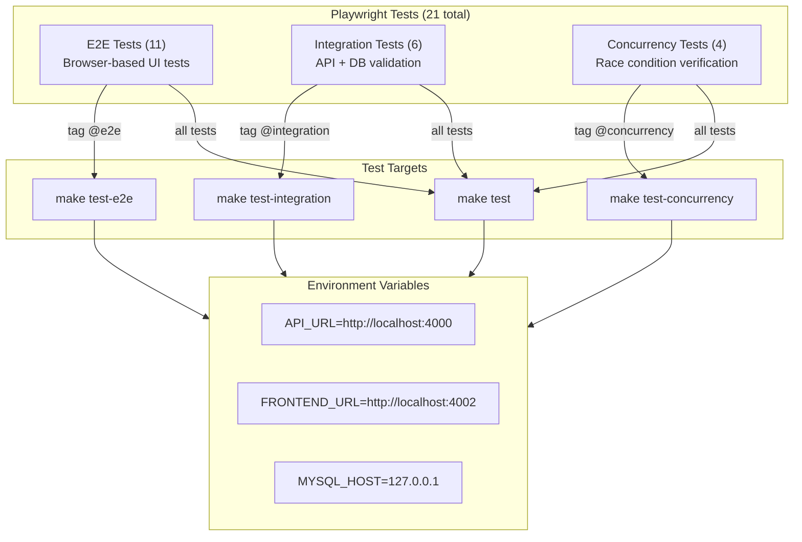

# Architecture

## Container Topology



## Port Mapping

| Service | Container Port | Host Port |
|---------|---------------|-----------|
| Frontend | 3000 | 4002 |
| Backend | 8000 | 4000 |
| MySQL | 3306 | 3306 |

## URL Shortening Flow



## URL Resolution Flow



## Database Schema



## Short Code Generation



The first 2 characters encode the bucket (0-999, giving 62² = 3844 possible values, well above the 1000 needed). The remaining 5 characters encode the counter (up to 62⁵ ≈ 916 million per bucket).

Because the bucket is derived from the URL content (via MD5), the same URL always falls into the same bucket. Combined with deduplication in `create_short_url`, identical URLs always produce the same short code.

### Worked Examples

#### Example 1: `https://example.com`

| Step | Calculation | Result |
|------|-------------|--------|
| MD5 hash | `md5("https://example.com")` | `f1c1592588411002af340cbaedd6fc8d` |
| bucket_id | first 8 hex → `0xf1c15925` = 4057319717 → `4057319717 % 1000` | **717** |
| base62(bucket) | `717 ÷ 62 = 11 rem 35` → `[11, 35]` → `11=b`, `35=Z` | **`bZ`** |
| next_counter | atomic `LAST_INSERT_ID(next_counter + 1)` | **1** |
| base62(counter) | `1 ÷ 62 = 0 rem 1` → `[0, 0, 0, 0, 1]` → `A, A, A, A, B` | **`AAAAB`** |
| short_code | bucket part + counter part | **`bZAAAAB`** |

The hex chars `f1c15925` are read as a **big-endian 32-bit unsigned integer** (0xf1c15925 = 4057319717), then reduced modulo 1000 to get bucket 717.

#### Example 2: `https://google.com`

| Step | Calculation | Result |
|------|-------------|--------|
| MD5 hash | `md5("https://google.com")` | `1d5920f4b44b27a802bd77c4f05327ea` |
| bucket_id | first 8 hex → `0x1d5920f4` = 493153012 → `493153012 % 1000` | **12** |
| base62(bucket) | `12 ÷ 62 = 0 rem 12` → `[0, 12]` → `0=A`, `12=C` | **`AC`** |
| next_counter | atomic `LAST_INSERT_ID(next_counter + 1)` | **1** |
| base62(counter) | `1 ÷ 62 = 0 rem 1` → `[0, 0, 0, 0, 1]` → `A, A, A, A, B` | **`AAAAB`** |
| short_code | bucket part + counter part | **`ACAAAAB`** |

Note both examples got counter=1 because they fall into different buckets (717 and 12), so each bucket's counter starts fresh at 1.

#### Base62 Alphabet

The encoding uses `0123456789ABCDEFGHIJKLMNOPQRSTUVWXYZabcdefghijklmnopqrstuvwxyz` (0-indexed). To encode an integer, repeatedly divide by 62: the remainder gives the rightmost character, the quotient feeds the next position leftward.

```
0→0, 1→1, ..., 9→9, 10→A, 11→B, ..., 35→Z, 36→a, ..., 61→z
```

**bucket_id → 2 chars:** `n = bucket_id`, output `[n/62², (n/62)%62, n%62]` (big-endian).

**counter → 5 chars:** `n = counter`, output `[n/62⁴, (n/62³)%62, (n/62²)%62, (n/62)%62, n%62]` (big-endian).

### Concurrency Safety

Counter allocation uses MySQL's `LAST_INSERT_ID(next_counter + 1)` inside `UPDATE`. This is atomic at the statement level — the UPDATE acquires an exclusive row lock, increments, and returns the new value in one operation. Two concurrent requests for the same bucket are serialized by MySQL's row-level locking, guaranteeing unique counters without application-level retries.

## Testing Architecture



### Concurrency Tests

Four tests verify the system's behavior under concurrent load:

| Test | What it validates |
|------|-------------------|
| Same URL 15 times | Dedup returns identical short_code |
| 30 different URLs | All short_codes are unique |
| 50 URLs globally | No short_code collisions at scale |
| 3 URLs x 10 each each | Batch dedup consistency across URLs |

Integration tests call the REST API directly via Playwright's `request` fixture and verify persistence by querying MySQL with `mysql2`. E2E tests run a real Chromium browser against the frontend and interact with the UI through Playwright locators.
