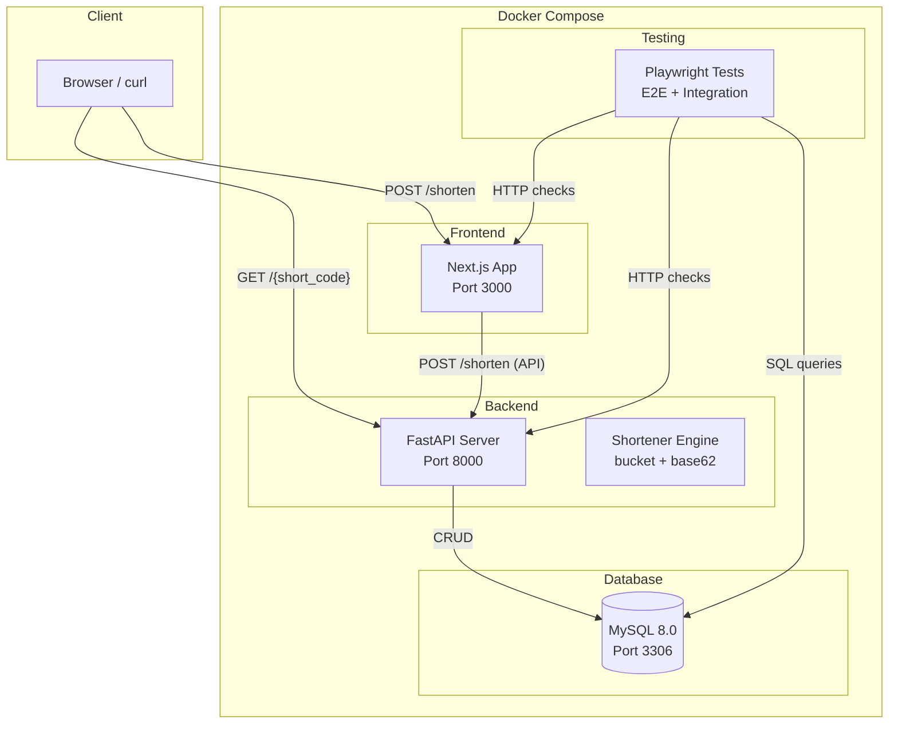
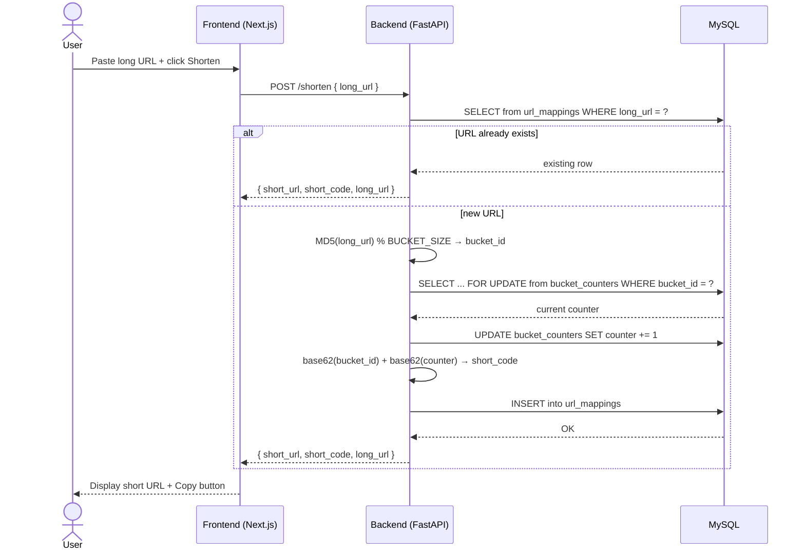
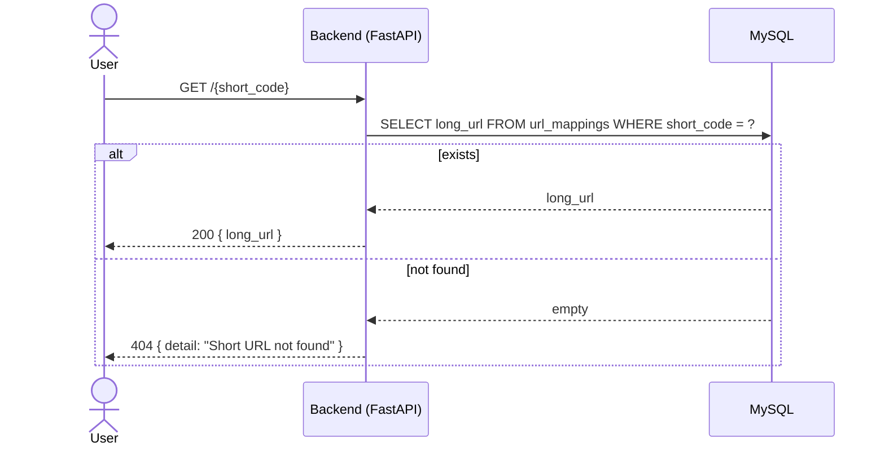
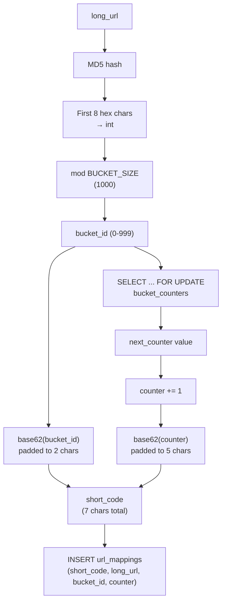

# Architecture

## System Overview



## URL Shortening Flow



## URL Redirect Flow



## Bucket Strategy



## Testing Pyramid

```mermaid
flowchart TB
    subgraph "E2E Tests"
        T1["UI form submit → short URL displayed"]
        T2["Short URL resolves to original"]
        T3["Copy button visible after shorten"]
        T4["Loading state during request"]
        T5["Error state on API failure"]
    end

    subgraph "Integration Tests"
        T6["POST /shorten → DB record created"]
        T7["GET /{code} → resolves long URL"]
        T8["Duplicate URL → same short code"]
        T9["Unknown code → 404"]
        T10["Bucket counters increment"]
    end

    subgraph "Unit Tests"
        T11["base62 encode/decode"]
        T12["get_bucket distribution"]
        T13["short_code format validation"]
    end

    T11 --> T12 --> T13
    T6 --> T7 --> T8 --> T9 --> T10
    T1 --> T2 --> T3 --> T4 --> T5
```



## Directory Layout

```
kata-testing/
├── .env                  # Shared env vars (DB creds, ports, config)
├── docker-compose.yml    # Orchestrates db + backend + frontend + tests
├── Makefile              # Dev workflow shortcuts
├── ARCHITECTURE.md       # This file
├── AGENTS.md             # Commands reference
│
├── backend/
│   ├── Dockerfile
│   ├── requirements.txt
│   └── app/
│       ├── main.py       # FastAPI routes
│       ├── database.py   # SQLAlchemy + MySQL connection
│       ├── models.py     # ORM models (UrlMapping, BucketCounter)
│       ├── schemas.py    # Pydantic request/response schemas
│       └── shortener.py  # Bucket strategy + base62 encoding
│
├── frontend/
│   ├── Dockerfile
│   ├── package.json
│   └── app/
│       ├── layout.tsx
│       ├── page.tsx      # URL shortener form UI
│       └── globals.css
│
└── testing/
    ├── Dockerfile
    ├── entrypoint.sh      # Wait for services → run tests
    ├── playwright.config.ts
    └── tests/
        ├── url-shortener.e2e.spec.ts
        └── url-shortener.integration.spec.ts
```
