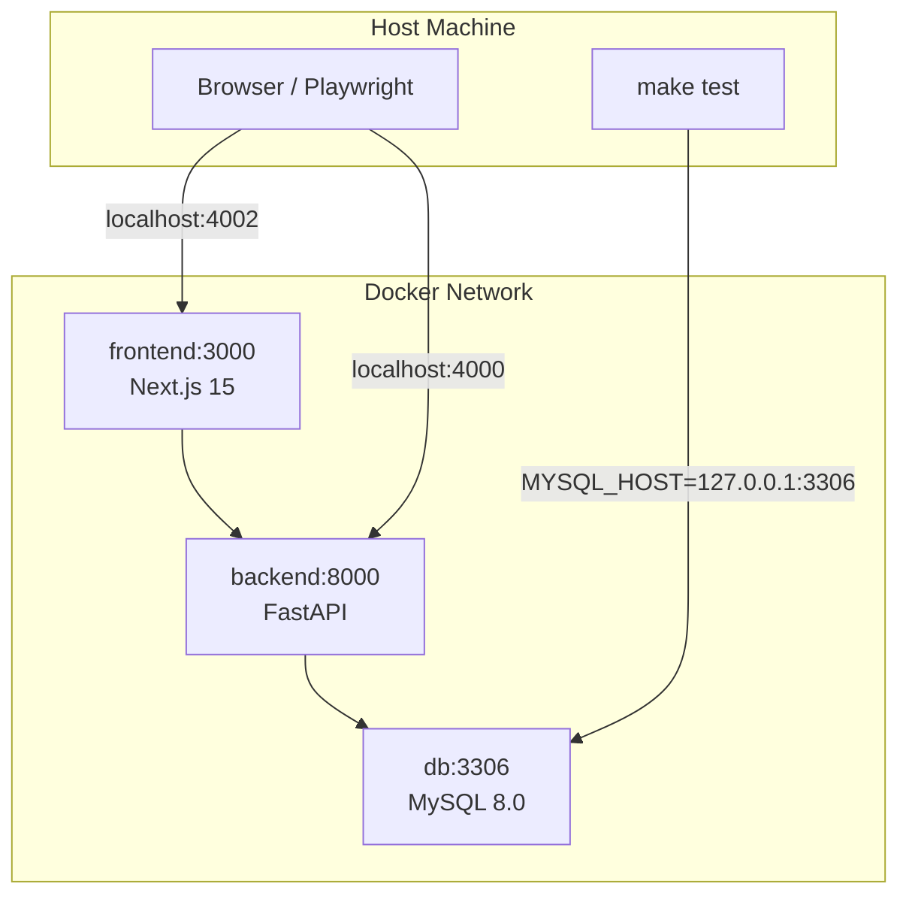
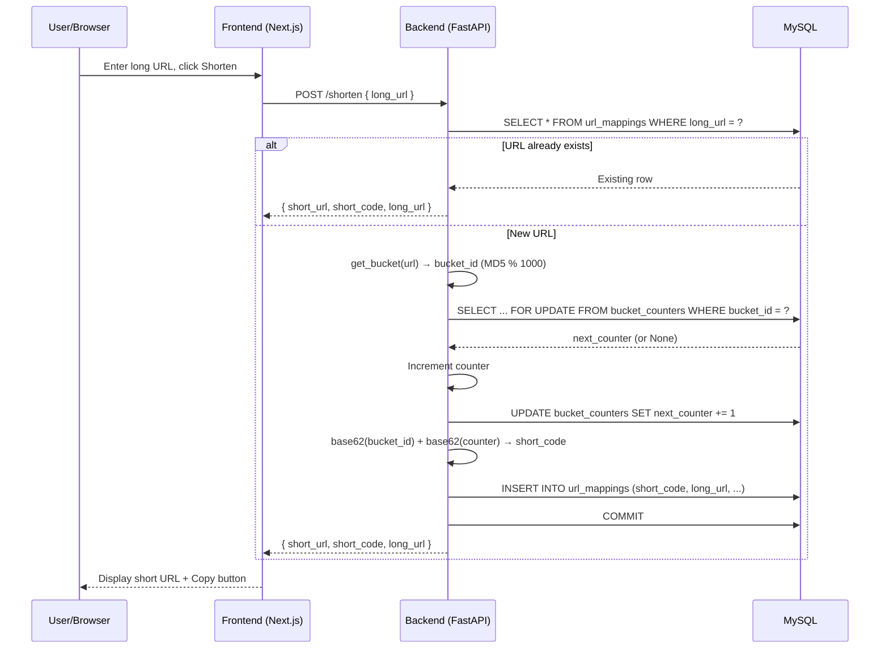
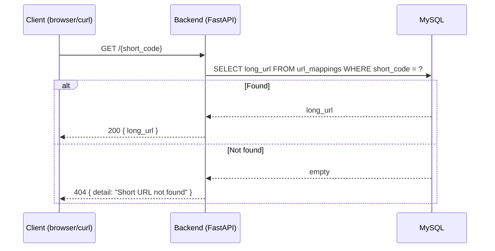
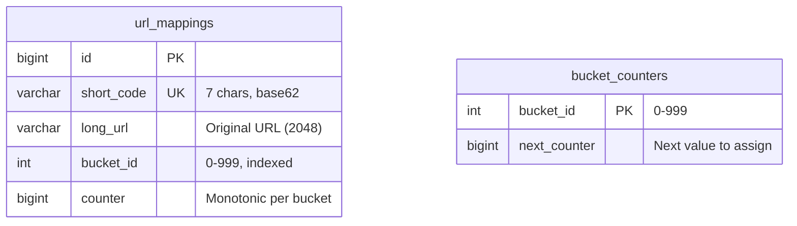
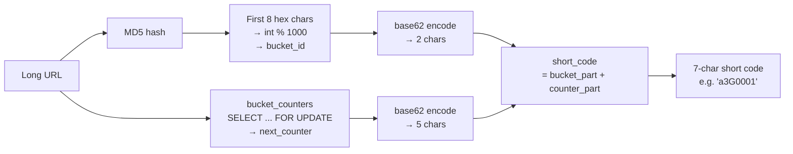
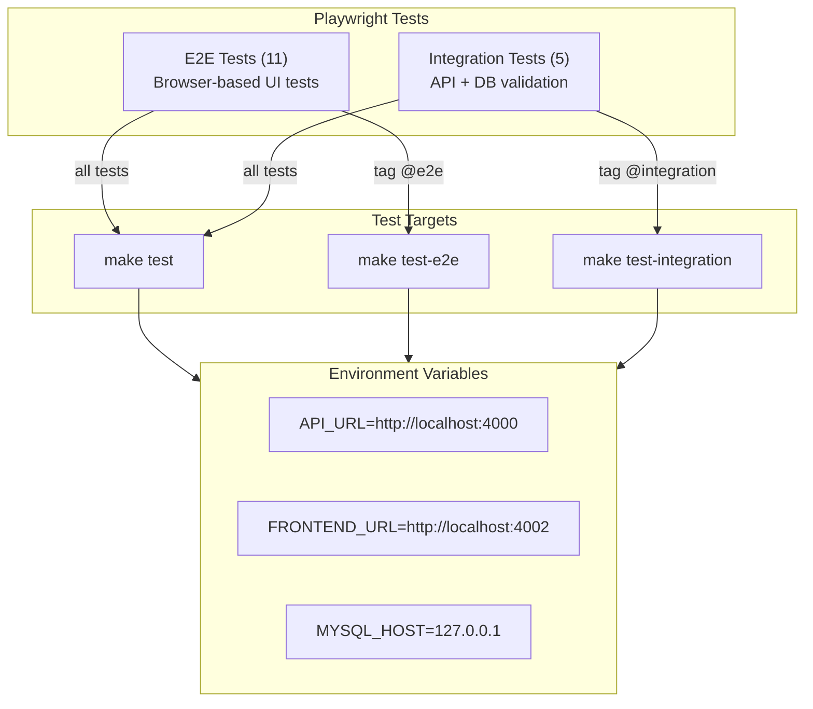

# Architecture

## Container Topology

## Port Mapping

| Service | Container Port | Host Port |
|---------|---------------|-----------|
| Frontend | 3000 | 4002 |
| Backend | 8000 | 4000 |
| MySQL | 3306 | 3306 |

## URL Shortening Flow

## URL Resolution Flow

## Database Schema

## Short Code Generation

The first 2 characters encode the bucket (0-999, giving 62² = 3844 possible values, well above the 1000 needed). The remaining 5 characters encode the counter (up to 62⁵ ≈ 916 million per bucket).

Because the bucket is derived from the URL content (via MD5), the same URL always falls into the same bucket. Combined with deduplication in `create_short_url`, identical URLs always produce the same short code.

## Testing Architecture

Integration tests call the REST API directly via Playwright's `request` fixture and verify persistence by querying MySQL with `mysql2`. E2E tests run a real Chromium browser against the frontend and interact with the UI through Playwright locators.
